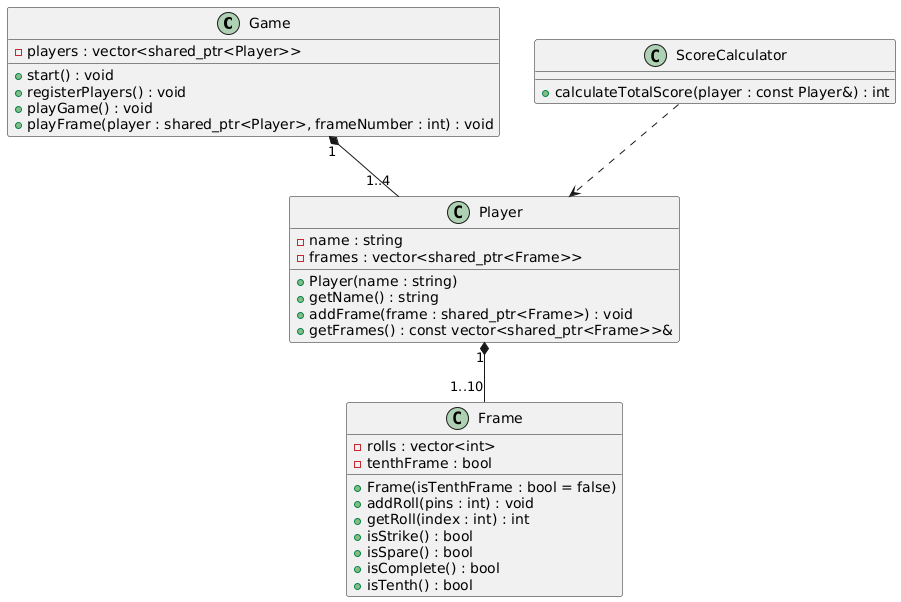

# 🎳 Bowling Game Scoring App (Console-Based)

A C++ console application to simulate a multiplayer bowling game.  
It allows up to 4 players, tracks scores per frame and per throw, handles strike/spare logic, and calculates total scores automatically.

---

## 📂 Folder Structure

```
BowlingGame/
├── inc/               # Header files (Player, Frame, Game, etc.)
├── src/               # Source files
├── test/              # Unit test files
├── doc/               # Documentation folder
├── CMakeLists.txt     # Build configuration
├── README.md          # Project instructions
```

---

## ✅ Features

- Supports 2–4 players
- Enter player names at runtime (with validation)
- Enter score after each throw
- Edit last input before confirmation
- Full 10-frame support (with bonus rolls)
- Live score updates after each round
- Unit-tested core components

---

## 🚀 Build & Run Instructions

### Prerequisites

- C++17 compiler
- CMake (>= 3.10)
- Git (to fetch Google Test)

---

### 🛠️ Build

You can use the provided `build_project.sh` script to build the project. The script offers options for building the project with or without unit tests, running the game, running unit tests, and performing a clean build.

#### Steps to Use the Build Script

1. Make the script executable:
   ```bash
   chmod +x build_project.sh
   ```

2. Run the script:
   ```bash
   ./build_project.sh
   ```

3. Select an option from the menu:
   - **1**: Build the project without unit tests.
   - **2**: Build the project with unit tests.
   - **3**: Perform a clean build (removes the `build` directory).
   - **4**: Run the game.
   - **5**: Run unit tests.
   - **6**: Exit the script.

#### Manual Build (Optional)

If you prefer to build manually, follow these steps:

```bash
# Clone gtest inside test/lib if not already
git clone https://github.com/google/googletest.git test/lib/googletest

# Create build directory
mkdir build
cd build

# Configure & compile
cmake ..
make
```

---

### ▶️ Run the Game

After building the project, you can run the game using the following command:

```bash
./BowlingGame
```

Follow the on-screen instructions to play the game. You can add up to 4 players, enter scores for each frame, and view live score updates after each round.

---

### 🧪 Unit Tests

Unit tests are written using Google Test and are located in the `test/` folder. The tests cover:

- **Score Calculation**: Perfect games, spares, and open frames.
- **Player Management**: Adding players and handling duplicate names.
- **Frame Logic**: Strike, spare, and frame completion logic.
- **Exception Handling**: Invalid inputs and duplicate player names.

#### Run Tests

After building the project, the test executable `BowlingGameTests` will be generated in the `build` directory. Run the tests using:

```bash
cd build
./BowlingGameTests
```

The test results will be displayed in the console.

---

### 📊 Class Diagram

Below is the class diagram for the Bowling Game Scoring App:


